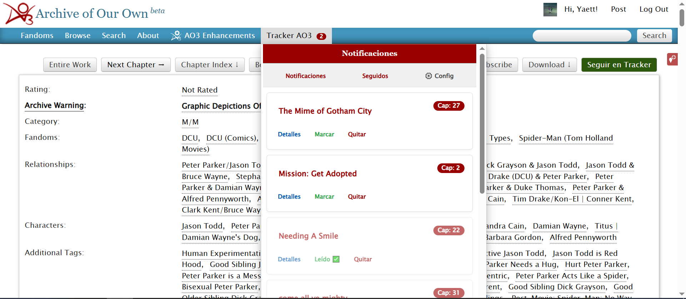
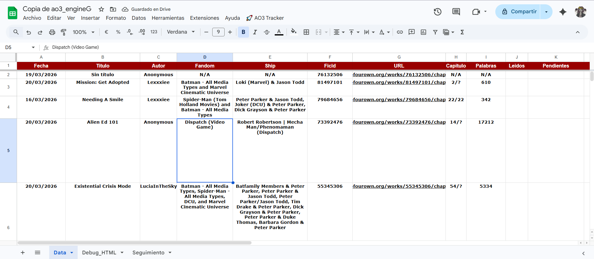
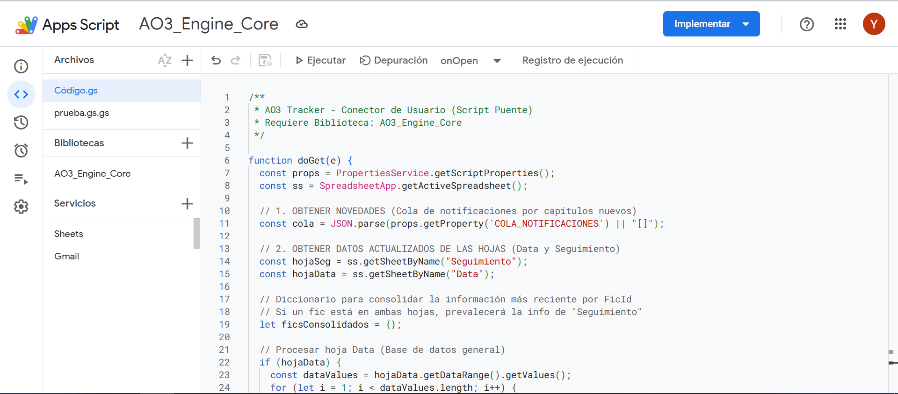

# 🚀 AO3 Tracker (Griyo Edition) **Readme provisional**

Current Status: v1.3-beta

Una extensión de navegador diseñada para rastrear actualizaciones de fanfics en **Archive of Our Own (AO3)** para mostrarlas en una bandeja accesible en la misma página con un enfoque de **Privacidad Total**. 

**No se guardan tus datos en servidores externos**.

## 🌟 Características

- **Notificaciones casi en tiempo real.** ***
- **Sincronización con Google Sheets:** Tu historial de lectura y las actualizaciones se guardan automáticamente en tu propia hoja de cálculo.
- **Arquitectura Decentralizada:** Sin costes de servidor, 100% privado y bajo tu control.
- **Badge Dinámico:** Un contador visual integrado en el menú de AO3 que te indica cuántos capítulos hay pendientes.
- **Estadísticas (a futuro):** 

 Capturas:
 -

 -Bandeja de notificaciones.

-Hoja de Google Sheet con muestra de registros:

-Pagina de Google Apps Script con codigo puente:

---

## 🛠️ Instalación (Paso a Paso)

Para que el tracker funcione de forma autónoma y esté siempre disponible "en la nube", configuraremos un motor personal en tu cuenta de Google.

### 1. El Excel (Base de Datos y Motor)
No necesitas programar el backend. Copia la **Plantilla Maestra** que ya incluye la estructura de tablas y el motor lógico.

*Nota: Para el rastreo automático, asegúrate de estar suscrito a las actualizaciones de tus fics en AO3 y que lleguen a tu bandeja de entrada del correo que usaste para copiar la hoja de calculo.*

1. **Copia la Plantilla:** Haz clic en [este enlace de la Plantilla Maestra](https://docs.google.com/spreadsheets/d/1vd1UlqOvEnscoWE-wfRHKgdQ4kEA2wov4RUTmCEJoJU/edit?usp=sharing) y selecciona `Archivo > Hacer una copia`.
2. **Accede al Script:** En tu nueva copia de Excel, ve a `Extensiones > Apps Script`. Allí verás el código que gestiona la lógica.
3. **Configuración de codigo puente:**
    -Ve a biblioteca, copia y busca este ID de la biblioteca: `1gy3mpZP4tfJT9pzuH_J3dAtyGnNyUbmNXDPVHPW6o_JnY3bv8JodWERz`
    -Asegurese de usar la ultima versión disponible.
    -Copie y reemplace el codigo que trae por defecto al copiar la hoja de calculo por el **codigo puente** que lo puede encontrar en: `Se subira más tarde`
    -Ejecute por primera vez usando la funcion `onOpen` seleccionandolo en el select al lado del boton de Depuración y autorice los permisos solicitados **(Aparecera el aviso de que no es seguro pero no te preocupes por eso, es un aviso porque como tal no esta verificada por google, pero el codigo base y lo que hace lo puedes verificar en el repositorio)**
    -Seleccione en **Configuración Avanzada** y luego a **Ir a AO3_Engine_Core** acepte los permisos.
    -Revisa que ahora tengas una nueva opción en la hoja de calculo llamada **🚀 AO3 Tracker**

3. **Configuración de la API:** - Haz clic en el botón azul **Implementar > Nueva implementación**.
   - Selecciona Tipo: **Aplicación web**.
   - Configura **"Ejecutar como":** `Yo` (tu cuenta).
   - Configura **"Quién tiene acceso":** `Cualquiera`. *(Esto permite que tu extensión envíe datos a tu hoja).*
4. **Copia la URL:** Guarda la URL de la aplicación web que termina en `/exec`.

### 2. La Extensión (Interfaz de Usuario)
1. **Descarga:** Baja el archivo `.zip` de la última [Release](link_a_releases) y descomprímelo en una carpeta.
2. **Instalación en Chrome:**
   - Ve a `chrome://extensions/`.
   - Activa el **"Modo desarrollador"** (esquina superior derecha).
   - Haz clic en **"Cargar descomprimida"** y selecciona la carpeta de la extensión.
3. **Vinculación:** - Abre AO3 y haz clic en el nuevo botón **"Tracker AO3"** en la barra superior.
   - Ve a la pestaña **⚙️ Configuración**.
   - Pega la **URL de tu Web App** de Google y pulsa **Guardar**.

---

## 🏗️ Arquitectura Técnica

El proyecto utiliza una estructura de tres capas para maximizar la privacidad y la eficiencia:

* **Frontend (Chrome Extension):** Desarrollada en JS Vanilla. Se encarga de inyectar la interfaz en la web de AO3, gestionar el almacenamiento local (`chrome.storage`) para una respuesta instantánea y manejar el badge de notificaciones.
* **Middleware (Google Apps Script):** Actúa como un servidor *serverless*. Procesa las notificaciones de Gmail mediante **Regex** para extraer metadatos de los fics (IDs, capítulos, sumarios) de forma automática.
* **Database (Google Sheets):** Almacenamiento persistente basado en una estructura de 14 columnas (A-N). Utiliza fórmulas inyectadas para calcular automáticamente los capítulos pendientes entre lo publicado y lo leído.

---

## 📊 Estructura de Datos (Columnas A-N)

Si deseas personalizar tu hoja de cálculo, esta es la disposición de los datos:

| Col | Campo | Descripción |
| :--- | :--- | :--- |
| **A** | Fecha | Última detección de actualización. |
| **B** | Título | Nombre de la obra. |
| **C** | Autor | Creador del fanfic. |
| **D** | Fandom | Categoría principal. |
| **E** | Ship | Relaciones/Parejas. |
| **F** | FicId | ID único de AO3. |
| **G** | URL | Enlace al último capítulo. |
| **H** | Capítulo | Capítulos totales (ej. 10/10). |
| **I** | Palabras | Conteo de palabras del cap actualizado. |
| **J** | Leídos | Último capítulo marcado por ti. |
| **K** | Pendientes | Cálculo automático (`H - J`). |
| **L** | Rating | Clasificación de contenido. |
| **M** | Warnings | Advertencias de AO3. |
| **N** | Sumario | Resumen de la historia. |

---

## 👩‍💻 Desarrollo

Para colaborar o modificar el proyecto:
1. Clona el repo: `git clone https://github.com/tu-usuario/ao3-tracker.git`
2. El código es **JS Vanilla** puro, sin dependencias externas ni compiladores complejos.
3. Para probar cambios visuales, simplemente recarga la extensión en la página de gestión de extensiones del navegador.

---
**Licencia:** MIT  
**Desarrollado por:** [Griyo](https://github.com/Grisyett)  
*Creado para que nunca te pierdas un capítulo y mantengas tus datos donde pertenecen: contigo.*